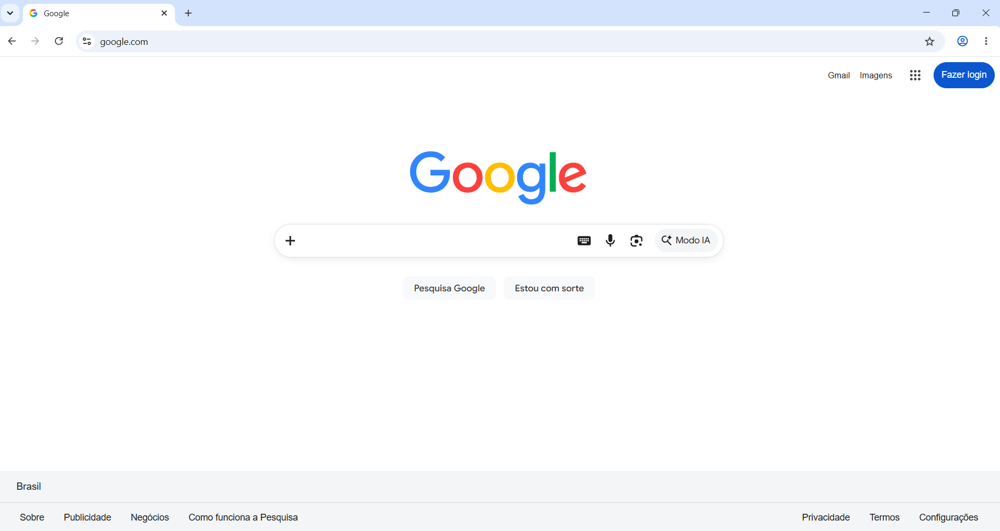
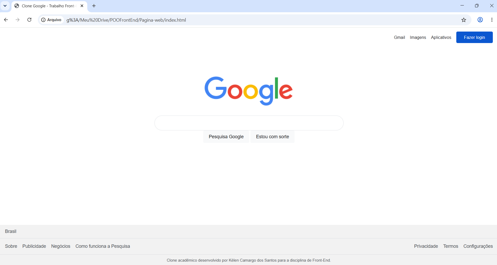

# Construção de Página Web com HTML e CSS

## Aluna

Nome: KÉLEN CAMARGO DOS SANTOS  
Matrícula: 1102339  

Trabalho desenvolvido para a disciplina de Front-End.

---

## Página de referência

Página inicial de pesquisa do Google.

https://www.google.com/

O objetivo do projeto foi reproduzir visualmente a página inicial de pesquisa do Google utilizando HTML semântico e CSS, sem copiar o código-fonte da página original.

---

# Checklist dos requisitos

## 1.1 Estrutura HTML semântica e acessível

- [x] Uso de HTML semântico
- [x] Imagem com atributo `alt`
- [x] Formulário funcional
- [x] Campo do formulário associado a um `label`

### Implementação

A página foi estruturada utilizando elementos semânticos como:

- `header`
- `nav`
- `main`
- `section`
- `footer`

O cabeçalho possui uma área de navegação com os links superiores da página.

A área principal foi criada utilizando a tag `main`, contendo uma `section` responsável pela área de pesquisa.

O rodapé utiliza a tag `footer` e contém uma navegação própria.

A imagem da logo possui o atributo:

```html
alt="Logo do Google"
```

O formulário de pesquisa possui um `label` associado ao campo através dos atributos:

```html
for="pesquisa"
```

e

```html
id="pesquisa"
```

O `label` foi mantido no HTML por questões de acessibilidade, mas foi ocultado visualmente através do CSS.

O formulário é funcional e envia o termo pesquisado para a busca do Google utilizando:

```html
action="https://www.google.com/search"
```

O campo possui:

```html
name="q"
```

---

## 1.2 Fidelidade visual à referência

- [x] Organização semelhante à página original
- [x] Cores semelhantes
- [x] Tipografia semelhante
- [x] Espaçamentos e proporções aproximados
- [x] Cabeçalho, conteúdo principal e rodapé reproduzidos

### Análise da página original

A página inicial do Google possui uma estrutura visual simples composta por três grandes regiões:

1. cabeçalho com links de navegação;
2. área principal com logo e formulário de pesquisa;
3. rodapé com país e links institucionais.

Essa estrutura foi reproduzida utilizando elementos semânticos equivalentes no HTML.

Foi utilizada a fonte Arial como aproximação da tipografia apresentada na referência.

As cores, dimensões da caixa de pesquisa, botões, espaçamentos e organização dos elementos foram reproduzidos visualmente com CSS.

Pequenas diferenças visuais podem existir devido à implementação acadêmica e à necessidade de utilizar apenas os conhecimentos abordados na disciplina.

---

## 1.3 CSS: seletores, box model e variáveis

- [x] Variáveis CSS
- [x] Seletor de elemento
- [x] Seletor de classe
- [x] Seletor descendente
- [x] Pseudo-classe
- [x] Aplicação de box model

### Variáveis CSS

Foram utilizadas variáveis no seletor `:root` para armazenar cores e outras propriedades reutilizadas no projeto.

Exemplos:

```css
:root {
    --cor-texto: #202124;
    --cor-borda: #dfe1e5;
    --cor-fundo: #ffffff;
    --cor-login: #0b57d0;
}
```

### Tipos de seletores utilizados

#### Seletor de elemento

Exemplo de seletor aplicado diretamente a um elemento HTML:

```css
body {
    margin: 0;
}
```

#### Seletor de classe

Exemplo de seletor aplicado por meio de uma classe:

```css
.campo-pesquisa {
    width: 100%;
}
```

#### Seletor descendente

Exemplo de seletor aplicado aos botões que estão dentro do elemento com a classe `acoes-pesquisa`:

```css
.acoes-pesquisa button {
    padding: 10px 16px;
}
```

#### Pseudo-classe

Foram utilizadas pseudo-classes para modificar a aparência dos elementos durante a interação do usuário.

Exemplo com `hover`:

```css
.campo-pesquisa:hover {
    box-shadow: 0 1px 6px rgba(32, 33, 36, 0.18);
}
```

Exemplo com `focus`:

```css
.campo-pesquisa:focus {
    box-shadow: 0 1px 6px rgba(32, 33, 36, 0.22);
}
```

### Box model

O box model foi utilizado em diferentes elementos da página através de propriedades como:

- `margin`
- `padding`
- `border`
- `width`
- `height`

Por exemplo, no campo de pesquisa foram utilizadas propriedades de largura, altura, espaçamento interno e borda:

```css
.campo-pesquisa {
    width: 100%;
    height: 46px;
    padding: 0 20px;
    border: 1px solid var(--cor-borda);
}
```

---

## 1.4 Responsividade: Flexbox, Grid e Mobile First

- [x] CSS desenvolvido em Mobile First
- [x] Uso de Flexbox
- [x] Uso de media query com `min-width`
- [x] Funcionamento em celular
- [x] Funcionamento em desktop

### Implementação

O CSS principal foi desenvolvido inicialmente para telas menores, seguindo a abordagem Mobile First.

O layout inicial funciona sem a utilização de media queries.

Foi utilizado Flexbox para organizar diferentes regiões da página, como:

- cabeçalho;
- navegação;
- área principal;
- formulário;
- botões;
- rodapé.

Para telas maiores foi utilizada uma media query com `min-width`:

```css
@media (min-width: 768px) {
}
```

No layout para telas menores, alguns elementos são organizados verticalmente.

Por exemplo, os botões da área de pesquisa seguem inicialmente uma organização adequada para telas menores.

Em telas maiores, a media query modifica o layout para organizar esses elementos horizontalmente.

Exemplo:

```css
@media (min-width: 768px) {

    .acoes-pesquisa {
        flex-direction: row;
        justify-content: center;
    }

}
```

A mesma abordagem foi utilizada no rodapé, que também passa a utilizar uma organização horizontal em telas maiores.

---

## 1.5 Personalização e originalidade

- [x] Personalização própria adicionada

Foi adicionada ao rodapé uma identificação informando que a página é um clone acadêmico desenvolvido para a disciplina de Front-End.

Esse elemento não existe na página original e foi incluído especificamente para atender ao requisito de personalização do trabalho.

---

# Comparação visual

Abaixo são apresentadas a página original utilizada como referência e a página desenvolvida no trabalho.

<table>
  <tr>
    <td align="center">
      <strong>Página original</strong>
    </td>
    <td align="center">
      <strong>Página desenvolvida</strong>
    </td>
  </tr>
  <tr>
    <td align="center">
      
    </td>
    <td align="center">
      
    </td>
  </tr>
</table>

---

# Histórico de desenvolvimento

O projeto foi desenvolvido em etapas, utilizando o Git para registrar a evolução do trabalho.

Principais etapas realizadas:

- Criação da estrutura inicial do projeto
- Desenvolvimento da estrutura HTML semântica
- Melhoria da semântica e acessibilidade
- Criação dos estilos base
- Desenvolvimento utilizando abordagem Mobile First
- Implementação da responsividade para telas maiores
- Ajustes de fidelidade visual
- Inclusão da personalização do projeto
- Inclusão da documentação e comparação visual no README

---

# Tecnologias utilizadas

- HTML5
- CSS3
- Flexbox
- Media Queries
- Git
- GitHub
- Visual Studio Code

---

# Considerações finais

O projeto permitiu aplicar os conteúdos trabalhados na disciplina de Front-End, incluindo estruturação semântica em HTML, acessibilidade, estilização com CSS, uso de seletores, variáveis, box model, Flexbox e desenvolvimento responsivo seguindo a abordagem Mobile First.

A página foi construída observando visualmente a página de referência e desenvolvendo a estrutura e os estilos manualmente.